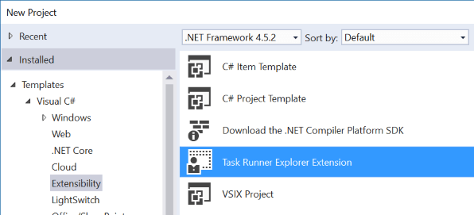
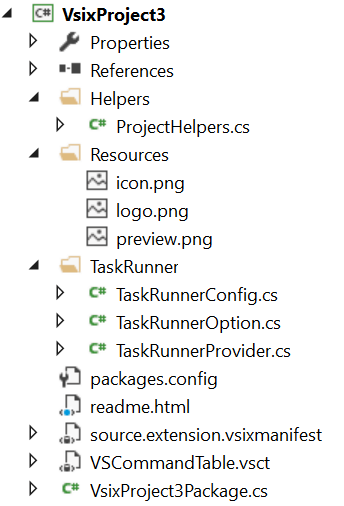

# TaskRunnerExtension

Download this extension from the [VS Gallery](https://visualstudiogallery.msdn.microsoft.com/20e4307e-e167-4bb5-8e99-6c5e5ce457ba)
or get the [CI build](http://vsixgallery.com/extension/e3f7a0d3-f521-4da8-8fa3-e3a07702328a/).

---------------------------------------

A project template for building Task Runner Explorer extensions for
Visual Studio.

See the [change log](CHANGELOG.md) for changes and road map.

## Features

- A great starting point
- Easy to customize
- Demonstrates best practices
- Opens a welcome page to get you started

Here's a screen shot of what the project template contains:

## Contribute
Check out the [contribution guidelines](.github/CONTRIBUTING.md)
if you want to contribute to this project.

For cloning and building this project yourself, make sure
to install the
[Extensibility Tools 2015](https://visualstudiogallery.msdn.microsoft.com/ab39a092-1343-46e2-b0f1-6a3f91155aa6)
extension for Visual Studio which enables some features
used by this project.

## License
[Apache 2.0](LICENSE)